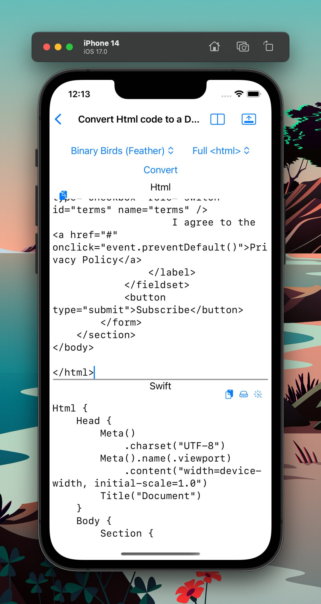

#  DevBliss - Your Local Development Helper for macOS and iOS

- [Why Choose DevBliss?](#why-choose-devbliss)
- [Key Features](#key-features)
  - [Converters](#converters)
  - [Generators](#generators)
  - [File Handling](#file-handling)
  - [Formatters](#formatters)
- [Getting Started](#getting-started)
- [Details](#details)
  - [HTML to Swift Converter](#html-to-swift-converter)
  - [Text Case Converter](#text-case-converter)
  - [Prefix Suffix Converter](#prefix-suffix-converter)
  - [Regex Match Extractor](#regex-match-extractor)
  - [JSON Formatter](#json-formatter)
  - [Swift Formatter](#swift-formatter)
  - [File Content Search](#file-content-search)
  - [Name Generator](#name-generator)
- [Contribute](#contribute)
  - [Build](#build)
  - [Adding a new tool](#adding-a-new-tool)
- [Thanks](#thanks)
- [Conclusion](#conclusion)
- [Similar projects](#similar-projects)


Welcome to DevBliss, a highly versatile and user-friendly software tool developed to boost your productivity as a developer. Built to operate locally on your macOS and iOS devices, DevBliss equips you with a suite of tools that are not just free of intrusive advertisements, but also prioritize your privacy by keeping all operations on your device.

## Why Choose DevBliss?

In an era where developers are seeking effective ways to maximize their productivity, DevBliss stands out with its feature-rich toolkit that optimizes your development workflow:

1. **On-device operation:** All of your data remains on your device, ensuring optimal privacy and zero distractions from unwanted ads.
2. **Cross-platform compatibility:** Available for both macOS and iOS, use DevBliss on your preferred device without losing any features.
3. **Seamless tool-to-tool operation:** Effortlessly shift the output from one tool to the input of another, streamlining your workflow.

## Key Features

There are already a few macOS apps with the basic converters and formatters. We try to add what's not available in other tools, with a few exceptions.

### Converters

Simplify your coding tasks with our diverse range of converters:

1. **HTML to Swift:** Transform your HTML code into Swift DSL code with ease.
1. **Text Case:** Toggle between kebab, snake, camel, and pascal cases to suit your coding style.
1. **Prefix Suffix Replace and Add:** Customize your code by replacing or adding prefixes or suffixes to each line.
1. **Regex Match Extract:** Efficiently extract the matches and the capturing groups from input text.

### Generators

Boost your efficiency with our generators:

1. **Name Generator:** Generate multiple none existing but readable names or words

### File Handling

1. **File Content Search:** Search for a string in a folder and get the line number, and preview the file content.

### Formatters

Improve your code readability with our formatter:

1. **Swift Formatter:** Beautify your Swift code with our pretty-print and syntax highlight features.
2. **JSON Formatter:** Beautify your JSON data with our pretty-print and syntax highlight features.


## Getting Started

(not yet) Getting started with DevBliss is as simple as downloading the app from the macOS or iOS store. Join our growing community of developers who are leveraging the power of DevBliss to enhance their productivity and code quality.

## Details  

### HTML to Swift Converter

For the DSLs [BinaryBirds/swift-html](https://github.com/BinaryBirds/swift-html) and [pointfreeco/swift-html](https://github.com/pointfreeco/swift-html)


<table>
  <tr>
    <td>  </td>
    <td>  </td>
  </tr>
</table>


### Text Case Converter


<table>
  <tr>
    <td>  </td>
    <td>  </td>
  </tr>
</table>

### Prefix Suffix Converter


<table>
  <tr>
    <td>  </td>
    <td>  </td>
  </tr>
</table>

### Regex Match Extractor


### JSON Formatter

Using [nkristek/Highlight](https://github.com/nkristek/Highlight.git)


<table>
  <tr>
    <td>  </td>
    <td>  </td>
  </tr>
</table>


### Swift Formatter

Using [nicklockwood/SwiftFormat](https://github.com/nicklockwood/SwiftFormat)

 

### File Content Search


### Name Generator

Generate names with three methods:
- randomly combining prefix sand suffix common names.
- alternating between vowels and consonants.
- assigning different weights to each letter and set the probability to alternate between vowel and consonant.

<table>
  <tr>
    <td>  </td>
    <td>  </td>
  </tr>
</table>

## Contribute

DevBliss is an open-source project, and we welcome contributions from our user community. If you have a feature request, bug report, or want to contribute to the code, please visit our GitHub issues or discussions.

Our structure takes inspiration from pointfree.co's [isowords](https://github.com/pointfreeco/isowords) project and we use [The Composable Architecture](https://github.com/pointfreeco/swift-composable-architecture). In this structure, every feature and its main dependency is encapsulated within its own library in the Swift package, allowing for an uncluttered and streamlined Xcode project for the app.

### Build

To get started, clone the repository and open the Xcode project of the app.
You will also be able to added the package libraries from there.

```bash
git clone https://github.com/atacan/DevBliss.git
open DevBliss/App/DevBliss.xcodeproj
```

### Adding a new tool
1. Create one library for the Client and one for the view
1. Add the new tool to the Tool.swift enum
1. Update AppReducer.swift
 
Troubleshotting: 
- if you get a `The compiler is unable to type-check this expression in reasonable time`, comment out the other tools in the reducer and let the compiler show the issue with the new tool edition.

## Thanks

- [stevengharris/SplitView](https://github.com/stevengharris/SplitView)
- [strings.dev](https://www.strings.dev) for the localization

## Conclusion

DevBliss is more than just a development tool - it's a catalyst for your coding productivity, a guardian of your privacy, and a platform that grows with your contributions. Experience the bliss of development with DevBliss - your local development powerhouse.

## Similar projects
- [DevToys for windows](https://devtoys.app/)
- [DevToys for Mac](https://github.com/ObuchiYuki/DevToysMac)
- [Boop](https://boop.okat.best)