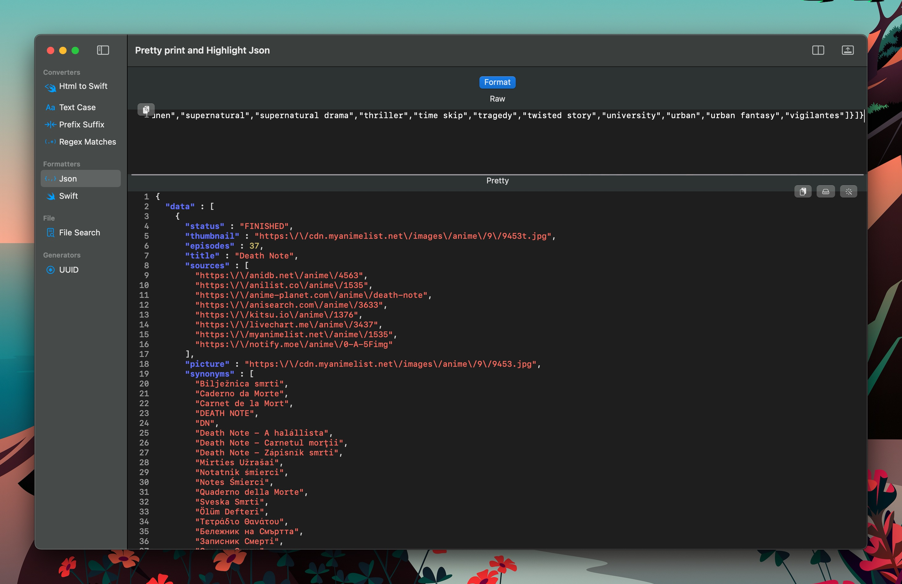

#  DevBliss - Your Local Development Helper for macOS and iOS

- [ DevBliss - Your Local Development Helper for macOS and iOS](#-devbliss---your-local-development-helper-for-macos-and-ios)
  - [Why Choose DevBliss?](#why-choose-devbliss)
  - [Key Features](#key-features)
    - [Converters](#converters)
    - [Formatters](#formatters)
    - [File Handling](#file-handling)
    - [Generators](#generators)
  - [Getting Started](#getting-started)
  - [Screenshots](#screenshots)
    - [HTML to Swift Converter](#html-to-swift-converter)
    - [Text Case Converter](#text-case-converter)
    - [Prefix Suffix Converter](#prefix-suffix-converter)
    - [Regex Match Extractor](#regex-match-extractor)
    - [JSON Formatter](#json-formatter)
    - [Swift Formatter](#swift-formatter)
    - [File Content Search](#file-content-search)
    - [UUID Generator](#uuid-generator)
  - [Contribute](#contribute)
  - [Conclusion](#conclusion)
  - [License](#license)
  - [Similar projects](#similar-projects)

Welcome to DevBliss, a highly versatile and user-friendly software tool developed to boost your productivity as a developer. Built to operate locally on your macOS and iOS devices, DevBliss equips you with a suite of tools that are not just free of intrusive advertisements, but also prioritize your privacy by keeping all operations on your device.

## Why Choose DevBliss?

In an era where developers are seeking effective ways to maximize their productivity, DevBliss stands out with its feature-rich toolkit that optimizes your development workflow:

1. **On-device operation:** All of your data remains on your device, ensuring optimal privacy and zero distractions from unwanted ads.
2. **Cross-platform compatibility:** Available for both macOS and iOS, use DevBliss on your preferred device without losing any features.
3. **Seamless tool-to-tool operation:** Effortlessly shift the output from one tool to the input of another, streamlining your workflow.

## Key Features

DevBliss bundles a variety of tools under three main categories: Converters, Formatters, and Generators.

### Converters

Simplify your coding tasks with our diverse range of converters:

1. **HTML to Swift:** Transform your HTML code into Swift DSL code with ease.
1. **Text Case:** Toggle between kebab, snake, camel, and pascal cases to suit your coding style.
1. **Prefix Suffix Replace and Add:** Customize your code by replacing or adding prefixes or suffixes to each line.
1. **Regex Match Extract:** Efficiently extract the matches and the capturing groups from input text.

### Formatters

Improve your code readability with our formatter:

1. **JSON Formatter:** Beautify your JSON data with our pretty-print and syntax highlight features.
2. **Swift Formatter:** Beautify your Swift code with our pretty-print and syntax highlight features.

### File Handling

1. **File Content Search:** Search for a string in a folder and get the line number, and preview the file content.

### Generators

Boost your efficiency with our generators:

1. **UUID Generator:** Generate multiple UUIDs instantly.

## Getting Started

(not yet) Getting started with DevBliss is as simple as downloading the app from the macOS or iOS store. Join our growing community of developers who are leveraging the power of DevBliss to enhance their productivity and code quality.

## Screenshots

### HTML to Swift Converter

<table>
  <tr>
    <td>  </td>
    <td>  </td>
  </tr>
</table>

### Text Case Converter

<table>
  <tr>
    <td>  </td>
    <td>  </td>
  </tr>
</table>

### Prefix Suffix Converter

<table>
  <tr>
    <td>  </td>
    <td>  </td>
  </tr>
</table>

### Regex Match Extractor

### JSON Formatter

<table>
  <tr>
    <td>  </td>
    <td>  </td>
  </tr>
</table>

### Swift Formatter

 

### File Content Search

### UUID Generator

## Contribute

DevBliss is an open-source project, and we welcome contributions from our user community. If you have a feature request, bug report, or want to contribute to the code, please visit our GitHub page.

Our architectural framework takes inspiration from pointfree.co's [isowords](https://github.com/pointfreeco/isowords) project using The Composable Architecture. In this structure, every feature is encapsulated within its own library in the Swift package, allowing for an uncluttered and streamlined Xcode project environment for the app.

## Conclusion

DevBliss is more than just a development tool - it's a catalyst for your coding productivity, a guardian of your privacy, and a platform that grows with your contributions. Experience the bliss of development with DevBliss - your local development powerhouse.

## License

MIT

## Similar projects
- [DevToys for windows](https://devtoys.app/)
- [DevToys For mac](https://github.com/ObuchiYuki/DevToysMac)
- [Boop](https://boop.okat.best)